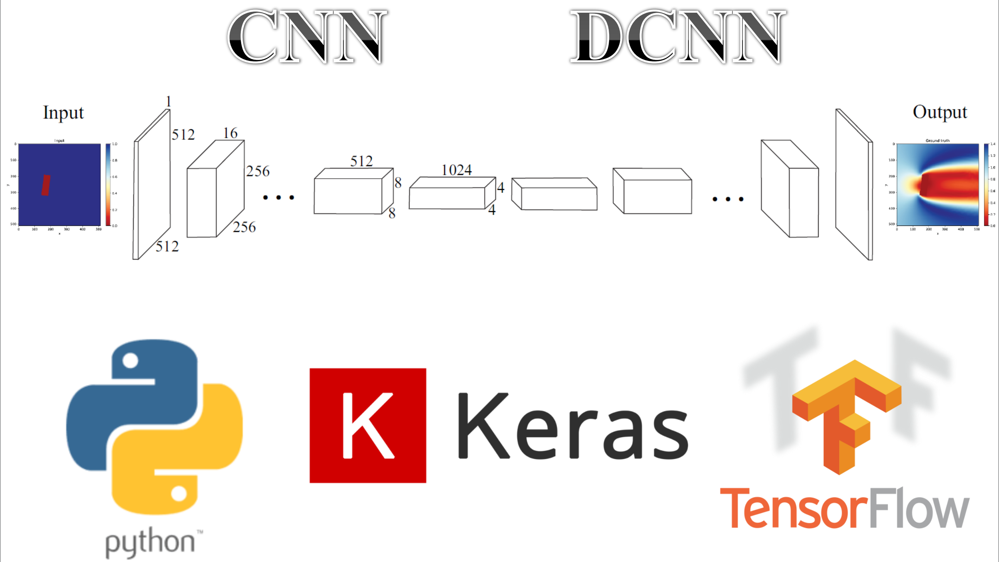

# Convolutional Neural Networks (CNNs) - Deconvolutional Neural Networks (DCNNs) for Computational Fluid Dynamics (CFD)
Predicting steady-state flow around bluff bodies using CNNs-DCNNs

**Author:** Ali Kashefi (kashefi@stanford.edu)  
**Description:** Please see slides for detailed explanations.  

**Slides**  
Please see the associated presentation [slides](https://web.stanford.edu/~kashefi/slides/CNN_CFD.pdf).

**Questions?**  
If you have any questions or need assistance, please do not hesitate to contact Ali Kashefi (kashefi@stanford.edu) via email. 

**About the Author**  
Please see the author's website: [Ali Kashefi](https://web.stanford.edu/~kashefi/) 
